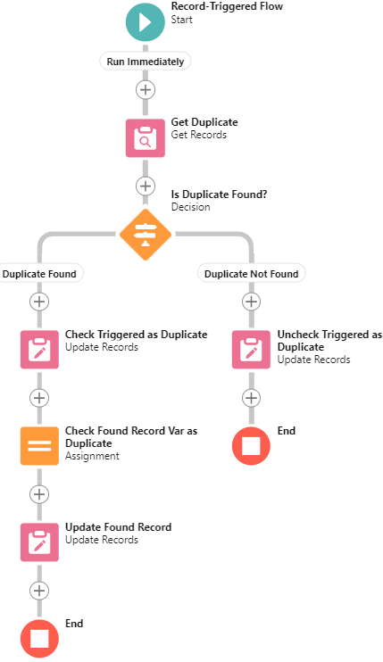
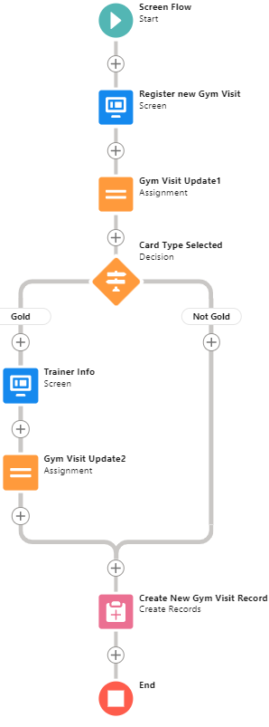
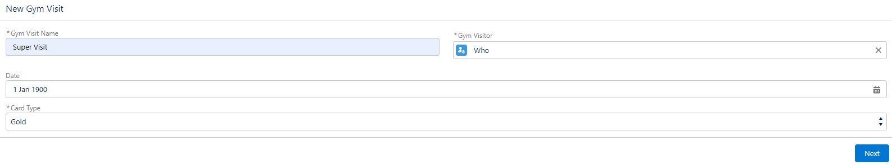
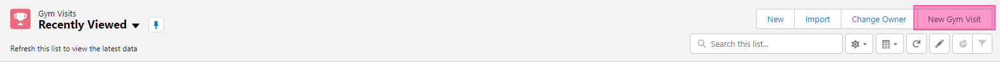

# #4 - Process Automation

1. Create field **“Duplicate”** on the object **Magic Property** and mark it as *True* during record creation (using flow) if record with same address already exist. Update duplicate field in existing object to *True* as well.
   
   

2. Create *Screen Flow* to register new **Gym Visits**. Fields: date, type. If Type is **Gold**, show up second screen to choose **Trainer Name** (create look up to **Contact**). Place flow as link in **Gym Visits** List. 

   
<<<<<<< HEAD

=======
    
   
    
   
    
>>>>>>> 52de59d (✔ Homework 4)
   