# #2 - Configuration

[Homework details](https://docs.google.com/document/d/1LrnpztkJL7kwjLea4Oc4dhPAlK_NPoHmFzwC3-cQGZ4/edit?usp=sharing)

-----

Plot Part

Feet co. is a #1 real estate agency in the Sherwood forest. It’s business is growing fast and it requires the power of Salesforce to build a powerful solution to satisfy the needs of its agents and all the furry magical customers it has.
The company’s CEO Mrs. Nutsy thinks that you are a great candidate for a Position of Head of Development department at Squirrel Feet co.
Your first task is to build a data model which would allow agents to enter Property information and also manage its residents. After that you will configure the UI for agents which show relevant information about properties and to allow them to manage it.
Mr. Nutsy has already read some articles about Salesforce therefore it recommends using the following standard functionality.

-----

Stakeholders

- Mrs. Nutsy - CEO
- Mr. Grey Bear - top performing agent

Standard Objects

- **Users** - are separate real estate agents
- **Account** - real estate business companies
- **Contact** - customers who want to buy/rent properties
- **Opportunity** - will help you associate your `Customers` with `Properties`. `Opportunity` Custom Fields:
  - Lookup: **Property**
- Other standard objects can also be used

Custom Objects

- Property (Record Types: **Rent**, **Sale**)

  - Lookup: **Account** - required
  - Text(255): **Property Title**
  - Number(16, 2): **Price**
  - Text(255): **Address**
  - Text Area (Long)(1000): **Description**
  - TextArea(Rich)(1000): **Property Image**
  - Date: **Available From**
  - Date: **Available Due**

- Payment
  - Lookup: **Property** - required
  - Formula Field: **Property Price**
  - Formula(Percent): **Real Estate Fee** (if Property is being _sold_ = 10% of Price, if Property is being _rented_ = 50% of Price)
  - Formula(Number): **Total Payment** (price and fee)
  - Picklist: **Status** (Payed, Prepared, Declined, Pending)
  - Lookup: **User** - required
  - Lookup: **Contact** - required

---

Business Requirements

- ***Property Information***  
Mrs. Nutsy wants a way to store relevant information about the properties. She currently doesn’t have time to specify all the information they gather about the properties, so she relies on your knowledge of real estate business. As a final note she added that their business supports both renting and selling of properties, so she’d be happy to have customized UI based on the type.
- ***Tracking the progress***  
Mr. Grey Bear also asking for an ability to track the progress of negotiations with potential Customers and thinks that Opportunity Path can be customized to suit his needs
Mrs. Nutsy has great confidence in your ability to deliver a great solution and therefore she provided some reference pictures which would help to ignite your imagination in data modeling. Also think about information that might be useful for customers.

---

<h2 style="text-align:center">Walk-through</h2>

1. Create custom Objects: `Property`, `Payment`.

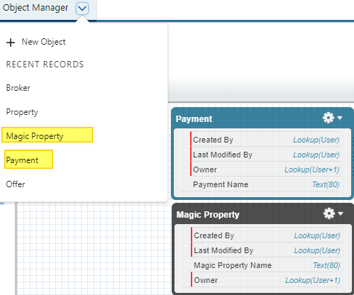

2. (optional) Create *custom* App.
3. (optional) Create tabs for `Property` and `Payment` objects add them to the App.

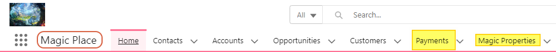 
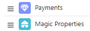

4. Create 2 *record* types for `Property` Object: `Rent`, `Sale`.

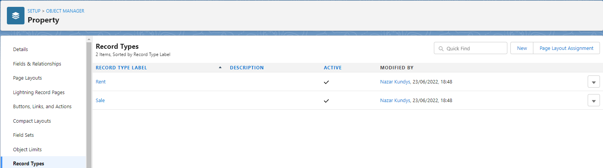  
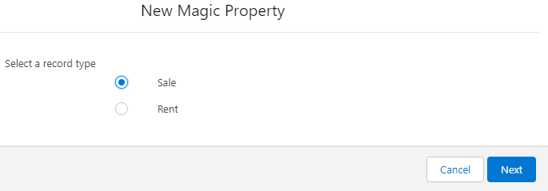

5. Create fields for `Property` and `Payment` objects.

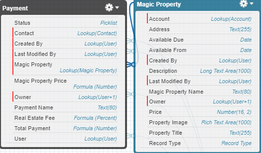

6. Create Validation rules:
   - Price cannot be less than Zero
   - Price cannot be empty
   - Available Due cannot be before Available From
  

7. Create two page layouts for Property: `Rent`, `Sale`.

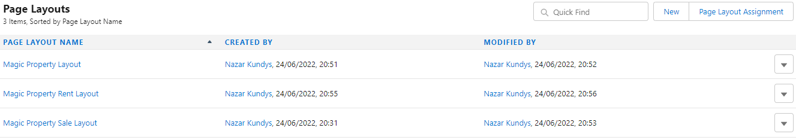

8. For created record types, specify the fields which suit more for the specific record type. Assign the correct page layouts to record types.

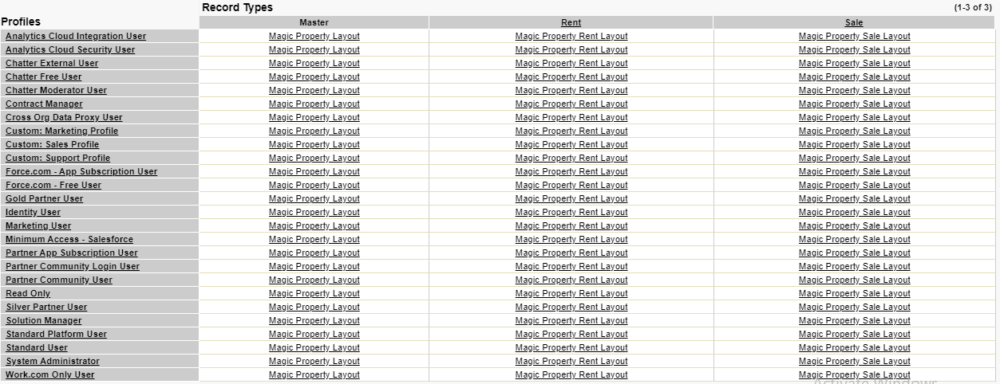

9. Create fields for the Opportunity standard object.

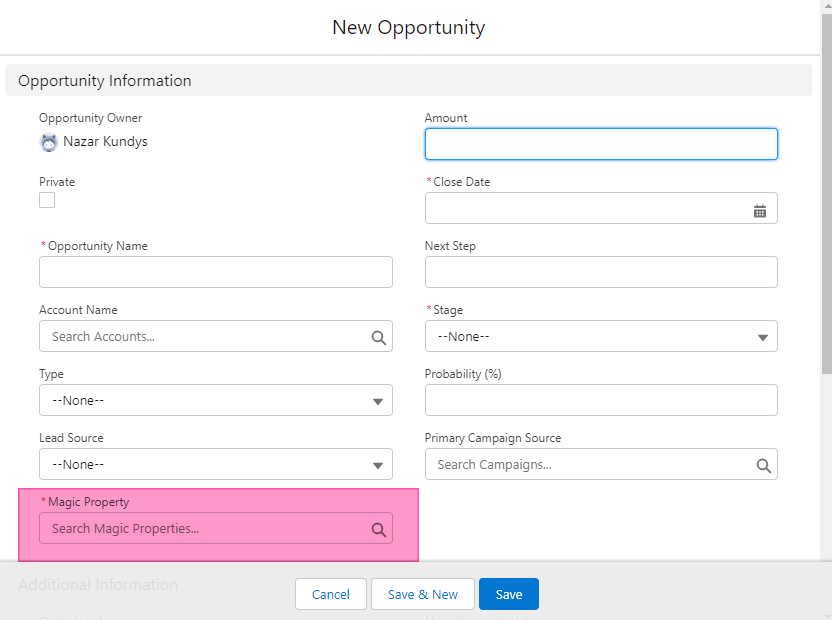

10. Create 4 Property records with pictures (see pictures attached below in the document)

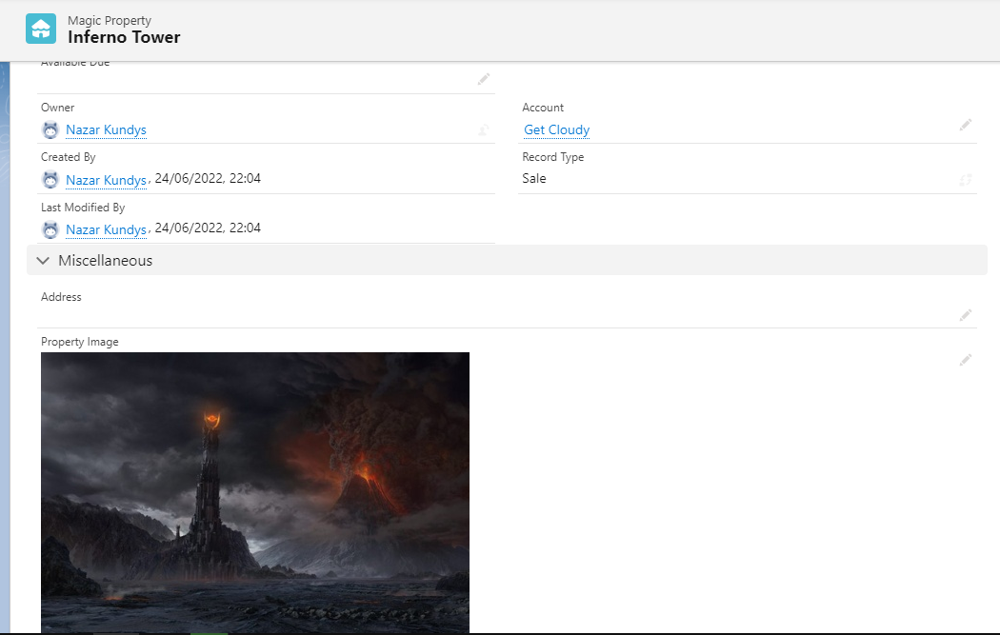  
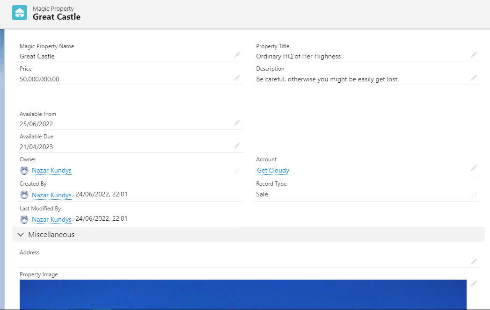  
  
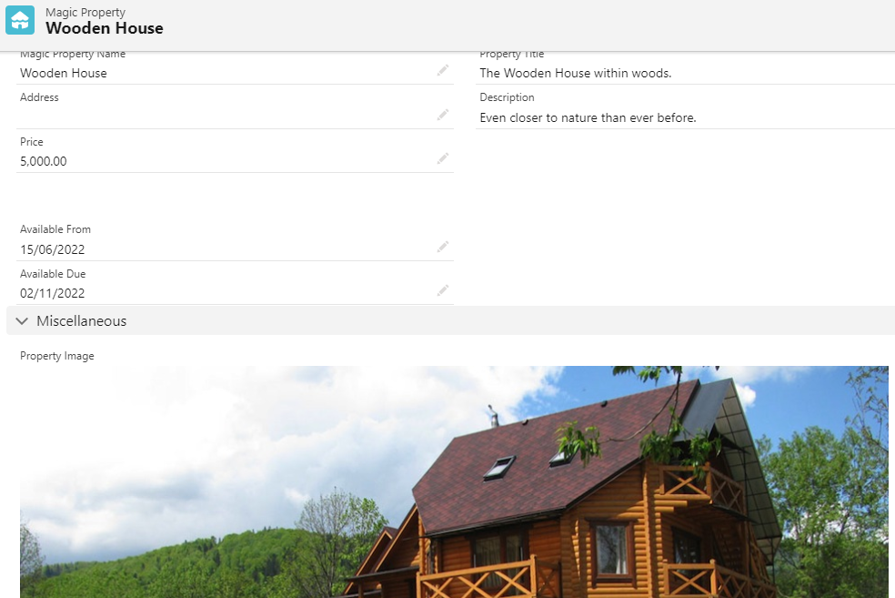  

11. Create Sample records for each created object and created field.

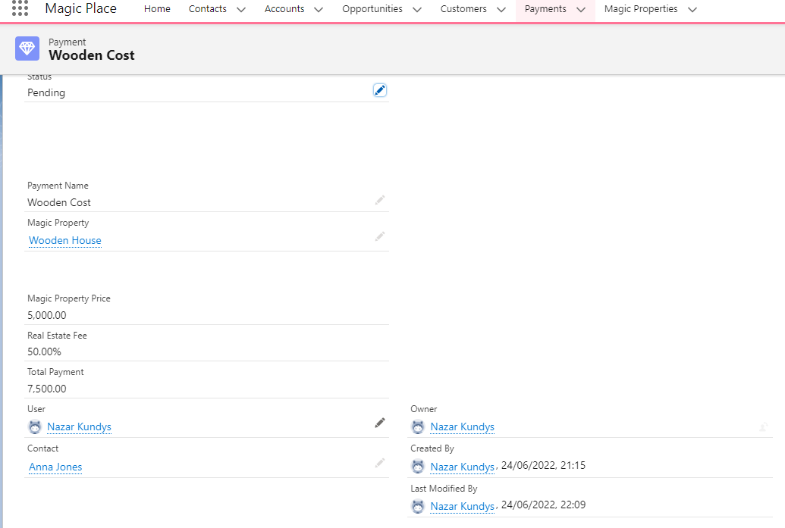  
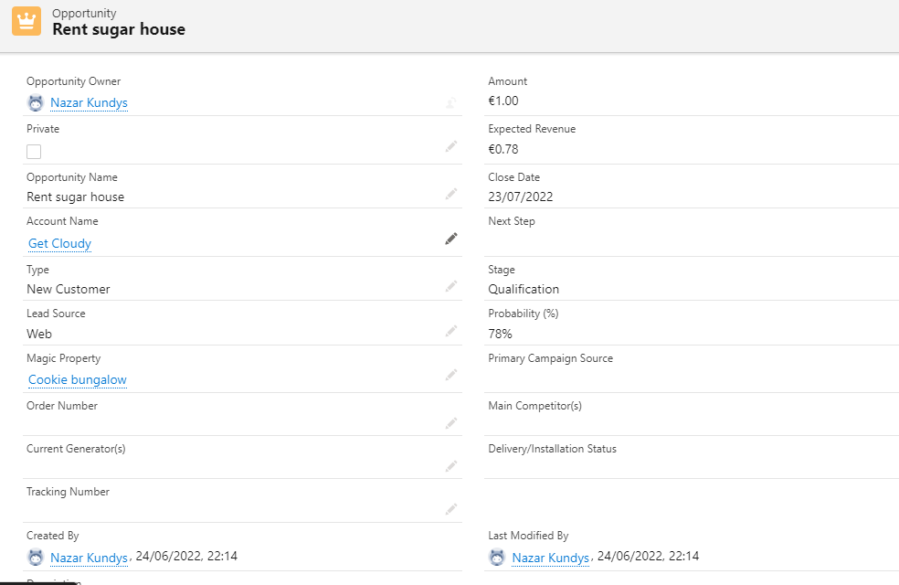  