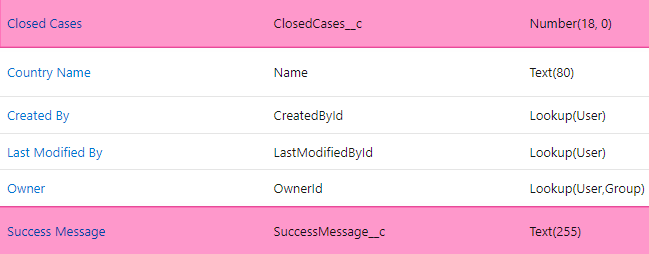
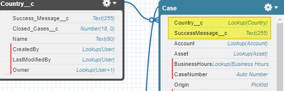
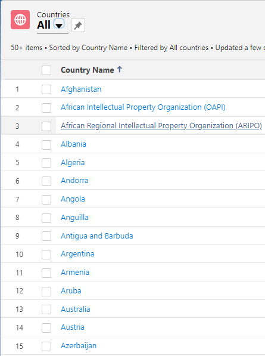

# #11 Apex Triggers

Noltic uses the standard Salesforce data model to track customer complaints. Now they have decided to become a worldwide leader and want to track the number of closed cases for each country. Try to achieve these requirements by expanding the data model with custom objects and fields. Use Apex Triggers to track the changes in objects.

1. Create a custom object - ***Country***.
Object Name: **Country**, API name - **Country__c**;
*Fields*: 
- Number (18, 0) - Label: **Closed Cases**, API Name - **ClosedCases__c**, default value = *0*;
- Text(255): **Success Message**, API Name - **SuccessMessage__c**.



2. Create custom fields in a standard ***Case*** object.
 Fields: 
- Text(255): **Received Success Message**, API Name - **SuccessMessage__c**;
- Lookup (Country__c): **Case’s Country**, API Name - **Country__c**.



3. Run script to insert country data.

```java
Set<String> countriesNames = new Set<String> {
        'French Polynesia', 'Mali', 'New Caledonia', 'Niger', 'European Union', 'Afghanistan', 'Albania', 'Algeria', 'Argentina', 'Australia', 'Austria', 'Bangladesh', 'Barbados', 'Belgium', 'Brazil', 'Brunei Darussalam', 'Bulgaria', 'Cambodia', 'Canada', 'China', 'Colombia', 'Uruguay', 'Bahrain', 'Honduras', 'Panama', 'Bolivia', 'Eurasian Patent Organisation (EAPO)', 'Gulf Cooperation Council', 'Canada (Design Patent)', 'Belize', 'Macau', 'Trinidad and Tobago', 'World Intellectual Property Organization (WIPO)/Hague', 'World Intellectual Property Organization (WIPO)/Madrid', 'African Intellectual Property Organization (OAPI)', 'Andorra', 'Angola', 'Anguilla', 'Antigua and Barbuda', 'Armenia', 'Aruba', 'Azerbaijan', 'Bahamas', 'Benelux', 'Bermuda', 'Bhutan', 'Bophuthatswana', 'Democratic Republic of Congo', 'Croatia', 'Cyprus', 'Czechia', 'Denmark', 'Egypt', 'Estonia', 'Ethiopia', 'Fiji', 'Finland', 'France', 'Gambia', 'Germany', 'Greece', 'Guatemala', 'Hong Kong', 'Hungary', 'Djibouti', 'Dominica', 'Ecuador', 'El Salvador', 'Eritrea', 'European Union', 'Falkland Islands', 'Federated States of Micronesia', 'Gaza', 'Ghana', 'Gibraltar', 'Grenada', 'Guam', 'Guernsey', 'Guyana', 'Haiti', 'Jersey', 'Kiribati', 'Kosovo', 'Lesotho', 'Liechtenstein', 'Malaya', 'Marshall Islands', 'Montserrat', 'Nauru', 'Netherlands Antilles', 'Niue', 'Northern Cyprus', 'Botswana', 'Burundi', 'Cabo Verde', 'Canada-Alberta', 'Canada-British Columbia', 'Canada-Manitoba', 'Canada-New Brunswick', 'Canada-Newfoundland and Labrador', 'Canada-Northwest Territories', 'Canada-Nova Scotia', 'Canada-Nunavut', 'Northern Mariana Islands', 'Palau', 'Puerto Rico', 'Sabah', 'Saint Helena', 'Saint Kitts and Nevis', 'Saint Lucia', 'Saint Vincent and The Grenadines', 'Samoa', 'Sao Tome and Principe', 'Sierra Leone', 'Suriname', 'Swaziland', 'Syrian Arab Republic', 'Tajikistan', 'Tanganyika', 'Iceland', 'India', 'Indonesia', 'Iran', 'Iraq', 'Ireland', 'Israel', 'Italy', 'Jamaica', 'Japan', 'Jordan', 'Kazakhstan', 'Kenya', 'Democratic People\'s Republic of Korea', 'Republic of Korea', 'Kuwait', 'Kyrgyzstan', 'Lao People\'s Democratic Republic', 'Latvia', 'Lebanon', 'Liberia', 'Libya', 'Lithuania', 'Luxembourg', 'The former Yugoslav Republic of Macedonia', 'Madagascar', 'Malawi', 'Malaysia', 'Canada-Ontario', 'Canada-Prince Edward Island', 'Canada-Quebec', 'Canada-Saskatchewan', 'Canada-Yukon', 'Cayman Islands', 'Cook Islands', 'Costa Rica', 'Cuba', 'Maldova', 'Tajikistan', 'Macedonia', 'Botswana', 'Eswatini', 'Ghana', 'Sao Tome and Principe', 'Sierra Leone', 'United Republic of Tanzania', 'Japan (Design Patent)', 'Trinidad and Tobago (Design Patent)', 'S. Korea (Design Patent)', 'Maldives', 'Malta', 'Mauritius', 'Mexico', 'Mongolia', 'Montenegro', 'Morocco', 'Mozambique', 'Myanmar', 'Namibia', 'Nepal', 'Netherlands', 'Timor Leste', 'Tonga', 'Transkei', 'Tunisia', 'Turkmenistan', 'Turks and Caicos Islands', 'Tuvalu', 'United Republic of Tanzania', 'US-Alabama', 'US-Alaska', 'US-Arizona', 'US-Arkansas', 'US-California', 'US-Colorado', 'US-Connecticut', 'US-Delaware', 'US-Florida', 'US-Georgia', 'US-Hawaii', 'US-Idaho', 'US-Illinois', 'US-Indiana', 'US-Iowa', 'US-Kansas', 'US-Kentucky', 'US-Louisiana', 'US-Maine', 'US-Maryland', 'US-Massachusetts', 'US-Michigan', 'US-Minnesota', 'US-Mississippi', 'US-Missouri', 'US-Montana', 'US-Nebraska', 'US-Nevada', 'US-New Hampshire', 'US-New Jersey', 'US-New Mexico', 'US-New York', 'US-North Carolina', 'US-North Dakota', 'US-Ohio', 'US-Oklahoma', 'US-Oregon', 'US-Pennsylvania', 'US-Rhode Island', 'US-South Carolina', 'US-South Dakota', 'US-Tennessee', 'US-Texas', 'US-Utah', 'US-Vermont', 'US-Virginia', 'US-Washington', 'US-West Virginia', 'US-Wisconsin', 'US-Wyoming', 'Uzbekistan', 'Vanuatu', 'Venda', 'Virgin Islands (British)', 'Virgin Islands (US)', 'West Bank', 'Yemen', 'Zanzibar (United Republic of Tanzania)', 'Maldova', 'Tajikistan', 'Macedonia', 'New Zealand', 'Nigeria', 'Norway', 'Oman', 'Pakistan', 'Papua New Guinea', 'Paraguay', 'Peru', 'Philippines', 'Poland', 'Portugal', 'Qatar', 'Romania', 'Russian Federation', 'Rwanda', 'Saudi Arabia', 'Serbia', 'Seychelles', 'Singapore', 'Slovakia', 'Slovenia', 'Solomon Islands', 'Somalia', 'South Africa', 'Spain', 'Sri Lanka', 'Sudan', 'Sweden', 'Switzerland', 'Taiwan', 'Thailand', 'Turkey', 'Uganda', 'United Arab Emirates', 'United Kingdom', 'United States of America', 'Zambia', 'Zimbabwe', 'European Patent Office', 'World Intellectual Property Organization (WIPO)/PCT', 'Ukraine', 'Vietnam', 'Belarus', 'Nicaragua', 'Republic of Moldova', 'San Marino', 'African Regional Intellectual Property Organization (ARIPO)', 'Georgia', 'Dominican Republic', 'Bosnia and Herzegovina', 'Monaco', 'Venezuela', 'Chile'
};

List<Country__c> countries = new List<Country__c>();
for (String countryName: countriesNames) {
    countries.add(
            new Country__c(
                Name = countryName,
                SuccessMessage__c = 'Hello, trailblazer! This is greeting from ' + countryName,
                ClosedCases__c = countryName.length()
            )
    );
}

insert countries;
```

As a result:  



4. If ***case*** is closed - update number of closed in current country and update in `Case` object the success message field with success message from the country.

##### Code:
*CaseTrigger.cls*
```java
trigger CaseTrigger on Case (before update, before insert, after update, after insert) {
    CaseTriggerHandler.handler(Trigger.new, Trigger.operationType);
}
```

*CaseTriggerHandler.cls*
```java
public with sharing class CaseTriggerHandler {

    public static void handler(List<Case> newCases, TriggerOperation triggerOperation) {
        switch on triggerOperation {
            when BEFORE_UPDATE, BEFORE_INSERT {
                CaseService.updateCases(newCases);
            }
            when AFTER_UPDATE, AFTER_INSERT {
                CaseService.incrementCountryClosedCases(newCases);
            }
        }
    }
}
```

*CaseService.cls*
```java
public with sharing class CaseService {
    public static void updateCases(Case[] triggerCases) {

        Set<Id> countryIds = new Set<Id>();     // IDs of countries related to triggered cases
        for (Case c : triggerCases) {
            if (c.Country__c != null) {
                countryIds.add(c.Country__c);
            }
        }
        // get country related to triggered cases
        Map<Id, Country__c> countryMap = new Map<Id, Country__c>([SELECT Id, SuccessMessage__c FROM Country__c WHERE Id IN :countryIds]);

        for (Case c : triggerCases) {
            Country__c country = countryMap.get(c.Country__c);

            if (country.SuccessMessage__c != null) {
                c.SuccessMessage__c = country.SuccessMessage__c;
            }
        }
    }

    public static void incrementCountryClosedCases(Case[] triggerCases) {
        List<Case> updatedCases = CaseSelector.closedCasesWithCountry(triggerCases);
        List<Country__c> countriesToUpdate = new List<Country__c>();

        for (Case c : updatedCases) {
            if (c.SuccessMessage__c == c.Country__r.SuccessMessage__c) {
                Country__c country = new Country__c(Id = c.Country__c, ClosedCases__c = c.Country__r.ClosedCases__c + 1);
                countriesToUpdate.add(country);
            }
        }
        update countriesToUpdate;
    }
}
```

CaseSelector.cls
```java
public with sharing class CaseSelector {
    public static Case[] closedCasesWithCountry(Case[] triggerCases) {
        return [
                SELECT Id, SuccessMessage__c, Country__c, Country__r.SuccessMessage__c, Country__r.ClosedCases__c
                FROM Case
                WHERE Id IN :triggerCases AND Status = 'Closed' AND Country__c != NULL
        ];
    }
}
```