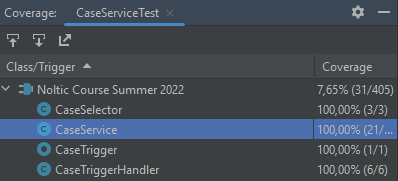

# #11 Apex Testing

→ Trailhead: [Apex Testing](https://trailhead.salesforce.com/en/content/learn/modules/apex_testing)

→ Write test methods to written code to
previous homework.

#### CaseServiceTest.cls
```java
@IsTest
private class CaseServiceTest {
    @IsTest
    static void testNewClosedCaseWithCountry() {
        // given
        Country__c country = new Country__c(Name = 'Wakanda', SuccessMessage__c = 'Hello, trailblazer! This is greeting from Wakanda!', ClosedCases__c = 0);
        insert country;
        Case someCase = new Case(Status = 'Closed', Country__c = country.Id, Country__r = country);

        // when
        Test.startTest();
        insert someCase;
        Test.stopTest();

        // then
        Case c = [SELECT SuccessMessage__c, Country__r.ClosedCases__c FROM Case WHERE Id = :someCase.Id];
        System.assertEquals(country.SuccessMessage__c, c.SuccessMessage__c);
        System.assertEquals(country.ClosedCases__c + 1, c.Country__r.ClosedCases__c);
    }

    @IsTest
    static void testNewClosedCaseNoCountry() {
        // given
        Case someCase = new Case(Status = 'Closed');

        // when
        Test.startTest();
        insert someCase;
        Test.stopTest();

        // then
        Case c = [SELECT SuccessMessage__c, Country__r.ClosedCases__c FROM Case WHERE Id = :someCase.Id];
        System.assertEquals(someCase.SuccessMessage__c, null);
    }

    @IsTest
    static void testNewClosedCaseWithCountry_bulk() {
        Country__c country = new Country__c(Name = 'Wakanda', SuccessMessage__c = 'Hello, trailblazer! This is greeting from Wakanda!', ClosedCases__c = 0);

        Integer amountOfCases = 150;
        Case[] cases = TestDataFactory.createCasesWithCountry(amountOfCases, country);

        // when
        Test.startTest();
        insert cases;
        Test.stopTest();

        // then
        Case[] retrievedCases = [SELECT SuccessMessage__c, Country__r.ClosedCases__c FROM Case WHERE Status = 'Closed' AND Country__c = :country.Id];
        System.assert(retrievedCases.size() == amountOfCases);
    }

    @IsTest
    static void testNewClosedCaseWithCountryWithoutMsg() {
        // given
        Country__c country = new Country__c(Name = 'Wakanda', ClosedCases__c = 0);
        insert country;
        Case someCase = new Case(Status = 'Closed', Country__c = country.Id, Country__r = country);

        // when
        Test.startTest();
        insert someCase;
        Test.stopTest();

        // then
        Case c = [SELECT SuccessMessage__c, Country__r.ClosedCases__c FROM Case WHERE Id = :someCase.Id];
        System.assertEquals(country.SuccessMessage__c, c.SuccessMessage__c);
        System.assertEquals(country.SuccessMessage__c, null);
        System.assertEquals(country.ClosedCases__c + 1, c.Country__r.ClosedCases__c);
    }
}
```

##### createCasesWithCountry method (in TestDataFactory)
```java
    public static List<Case> createCasesWithCountry(Integer caseCount, Country__c country) {
        List<Case> cases = new List<Case>();
        for (Integer i = 0; i < caseCount; i++) {
            cases.add(new Case(Status = 'Closed', Country__c = country.Id));
        }
        return cases;
    }
```

Code Coverage is <br>
