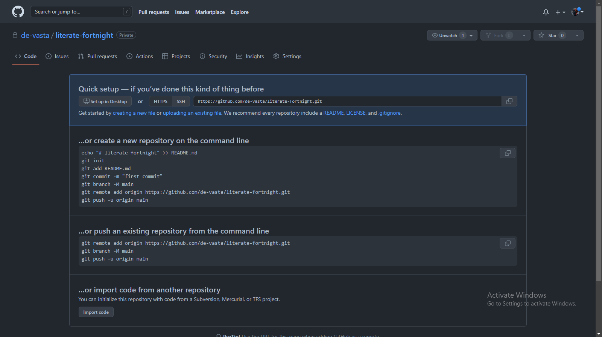
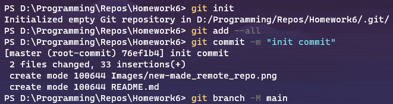
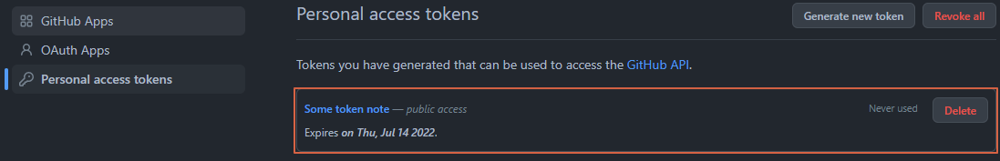
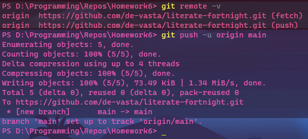
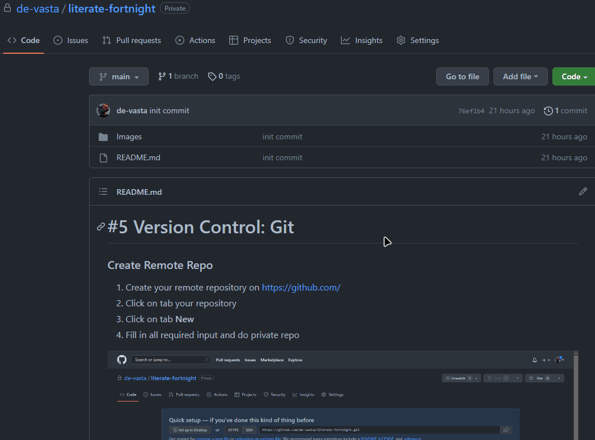
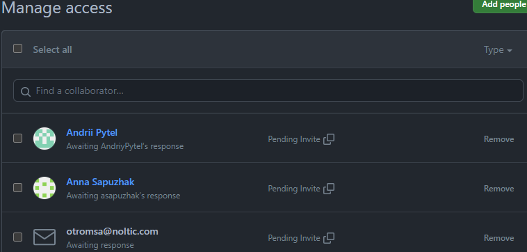
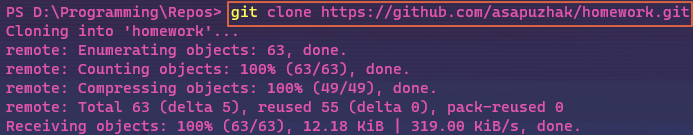
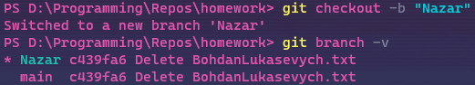
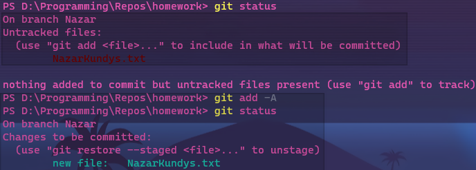
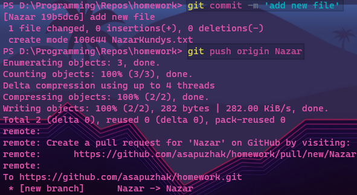

# #5 Version Control: Git

### Create Remote Repo

1. Create your remote repository on https://github.com/
2. Click on tab your repository
3. Click on tab **New**
4. Fill in all required input and do private repo

### Create Local Repo and push to remote.

1. Open Terminal
2. Navigate to project
3. Execute git init
4. Execute git `add .`
5. Execute `git commit -m “init commit”`
6. Execute `git branch -M main`
   

7. Execute `git remote add origin https://github.com/yourGitHubName/yourRepoName.git`
8. Create your private access token

9.  Execute `git push -u origin main`
    
 

10.  Give asapuzhak@noltic.com, otromsa@noltic.com, apytel@noltic.com access to your repo (*yourRepo* -> **Settings** -> **Collaboration** -> **Manage Access** -> **Add People**)

### How to create pull request

1. Accept invite on email; execute `git clone https://github.com/asapuzhak/homework.git`
   

2. Execute `git checkout -b <yourName>`

3. Add new file with your name and surname (e.g. VitaliiZekter)
4. Execute `git add .`

5. Execute `git commit -m ‘add new file’`
6. Execute `git push origin <yourName>`

     
(The name of the branch has been renamed to "*NazarKundys*" to avoid further misunderstandings)

7. Create PR on https://github.com/

