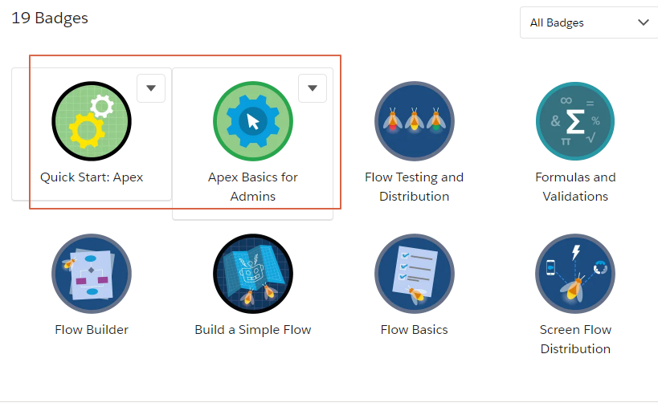

# #7 Intro to Apex

* Trailhead - [Apex Basics for Admins](https://trailhead.salesforce.com/content/learn/modules/apex-basics-for-admins)
* Trailhead - [Quick Start Apex](https://trailhead.salesforce.com/content/learn/projects/quickstart-apex)



* Documentation - [Writing Apex](https://developer.salesforce.com/docs/atlas.en-us.apexcode.meta/apexcode/apex_writing.htm)
   
<br>

* **Practical Task**: You have to do God's job. God class must have 2 methods - `createMan(String name)` and `createWoman(String name)`, which return objects of class `Man` and `Woman`, each containing respective object (representing *Adam* and *Eve*). Both objects have to be subclasses of `Human`. Your job is to implement the `God`, `Human`, `Man` and `Woman` classes.

##### God
```java
public class God {
    public static Man createMan(String name) {
        return new Man(name);
    }

    public static Woman createWoman(String name) {
        return new Woman(name);
    }
}
```

##### Human
```java
public abstract class Human {
    public String Name { get; protected set; }

    public Human(String name) {
        Name = name;
    }
}
```

##### Man
```java
public class Man extends Human {
    public Man(String name) {
        super(name);
    }
}
```

##### Woman
```java
public class Woman extends Human {
    public Woman(String name) {
        super(name);
    }
}
```